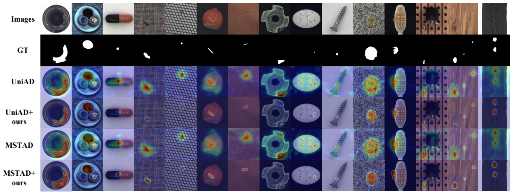

# MUM-UAD
Official PyTorch Implementation of [Enhancing Unsupervised Unified Anomaly Detection via Semi-Supervised Learning with Multi-Source Uncertainty Mining], submitted to Neurocomputing.


- **Create the dataset directory**. Download the dataset. The dataset directory should be as follows. 

```
|-- data
    |-- dataset name
        |-- category
		|-- train
			|-- good
		|-- test
			|-- good
			|-- 1
		|-- ground_truth
			|-- 1
```
- **Generate fake labels**
Multi-source pseudo-labels are generated by binarizing the anomaly score maps produced by four unsupervised models—EdgRec, DRÆM, FastFlow, and MSTAD—trained on the original training set. The binarization threshold is set to the 98th percentile of the anomaly score distribution for each model.

The fake label directory should be as follows. 
```
|-- flabels
    |-- dataset name
    	|-- method name
		|-- category
			|-- good
			|-- 1
			
```
You can download the fake labels for MVTec AD, VisA and BTAD from baidu Netdisk.
链接: https://pan.baidu.com/s/1lprjJG4DeERaowz4dtG25g 提取码: g8dn

- **Modify path**
1. change "root_image" to the path of your dataset.
2. change "root_flabels" to the path of your fake labels
3. change "base_model_weight_path" to the path of the base model

- **Train or eval** by running python tools/train_val.py

- **Results and checkpoints**. 
You can download the checkpoints for MVTec AD, VisA and BTAD from baidu Netdisk.
链接: https://pan.baidu.com/s/1MDKBMbJ-ohhu9jnhTBASHQ 提取码: b9d3



The code is implemented in pytorch, and most basic codes are from UniAD(https://github.com/zhiyuanyou/UniAD), DRAEM(https://github.com/VitjanZ/DRAEM), UMNet(https://github.com/yifanw90/UMNet), a big thanks to their great work.


